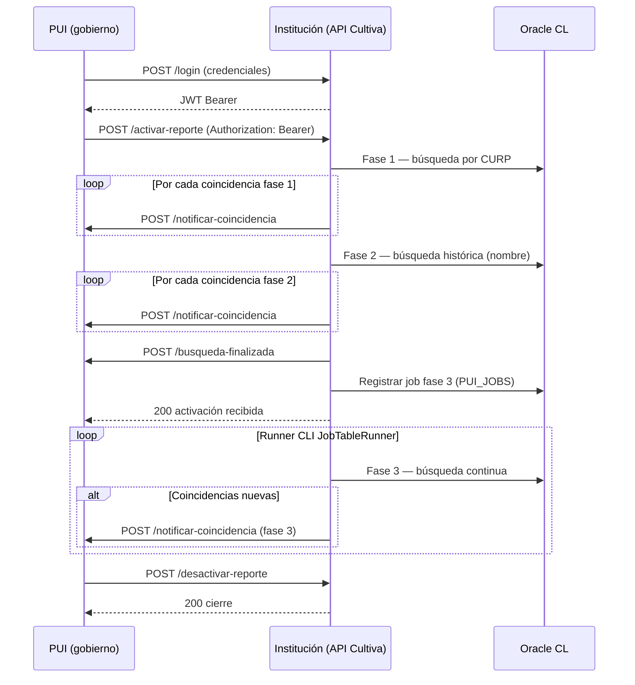

# Flujo PUI — modelo por eventos (Manual Técnico)

Diagrama de secuencia entre **PUI** (plataforma gubernamental) e **institución** (Cultiva expone los endpoints bajo `/api/pui`).

**Notas de implementación**

- `busqueda-finalizada` se invoca **después** de completar fases 1 y 2.
- La fase 3 es asíncrona mediante tabla `PUI_JOBS` y runner CLI (`backend/Jobs/controllers/JobTableRunner.php`).
- Los endpoints salientes (`notificar-coincidencia`, `busqueda-finalizada`) usan `PUI_OUTBOUND_BASE_URL` y rutas configurables en `pui.ini`.
- Modo `MOCK` evita HTTP real; modo `REAL` usa `HttpPuiOutboundClient` con reintentos.
- `GET /api/pui/persona/{curp}` y `POST /api/pui/busqueda` son endpoints auxiliares (debug/monitoreo), controlados por flags de configuración.
